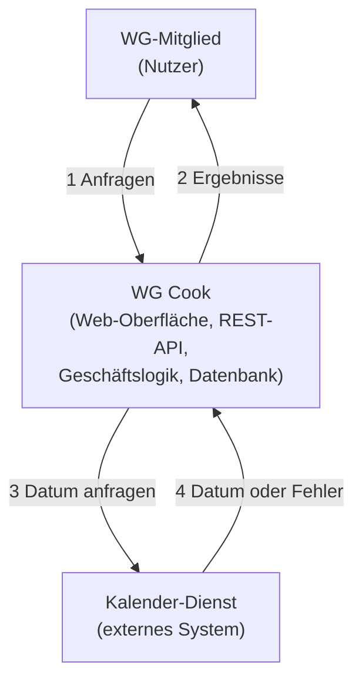

## 1 Kontextdiagramm

Das System **WG Cook** ist eine Box. Akteure und externe Systeme stehen außerhalb, jede Linie ist eine Interaktion. Die Datenbank gehört zum System und steht deshalb nicht als eigenes Element außerhalb.

## 2 Erklärung der Elemente und Beziehungen

| Element | Beschreibung | Interaktion mit WG Cook |
|---|---|---|
| **WG Cook (System)** | Die zu entwickelnde Anwendung: Web-Oberfläche, REST-API (Python FastAPI), Geschäftslogik und Datenhaltung (PostgreSQL). Sie verwaltet Rezepte mit Zutaten, berechnet zu einer Zutatenauswahl passende Rezepte und sortiert sie saisonal. | Alle Funktionen aus `requirements.md`. |
| **WG-Mitglied** | Der einzige Akteur: Mitglied einer Wohngemeinschaft, die gemeinsam einen Kühlschrank nutzt. Es gibt keine Anmeldung und keine weiteren Rollen. | Es legt Rezepte an, ändert und löscht sie, wählt vorhandene Zutaten aus, sucht Rezepte und sieht Rezepte mit Zutaten. Das System antwortet mit Trefferliste, Details, Hinweisen und Fehlermeldungen. |
| **Kalender-Dienst** | **Externe Abhängigkeit.** Liefert das aktuelle Datum, aus dem das System die Saison ableitet. | Das System **ruft** ihn bei einer Suche auf (höchstens einmal je 24 Stunden dank Zwischenspeicherung) und erhält Datum oder Fehler. Bei Ausfall setzt das System die Suche ohne Saison-Bevorzugung fort. |

**Zentrale Beziehungen:**

- Der Nutzer arbeitet nur mit dem System, **nie direkt** mit dem Kalender-Dienst. Dieser ist für ihn unsichtbar, nur ein Hinweis erscheint, wenn er ausfällt.
- Die Abhängigkeit steht **außerhalb** der Systemgrenze. Das System kontrolliert sie nicht und muss mit ihrem Ausfall umgehen können (FR-12).
- Die Kommunikation mit dem Kalender-Dienst ist **nur ausgehend** (System fragt an), der Dienst startet von sich aus keine Interaktion.

---

