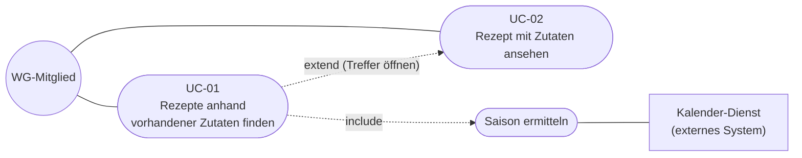

## 1 Gewähltes Feature

Wir beschreiben das Feature **"Rezepte anhand vorhandener Zutaten finden"**. Es ist der Kern von WG Cook, betrifft die **Primärentität Rezept** (mit der Kind-Entität Zutat) und nutzt die **externe Abhängigkeit** (Kalender-Dienst). Es besteht aus den Use Cases UC-01 (Rezepte finden), UC-02 (Rezept ansehen) und dem enthaltenen Schritt "Saison ermitteln".

## 2 Use-Case-Diagramm

Der Kreis ist der Akteur, ein Oval ist ein Use Case, gestrichelte Pfeile sind Beziehungen (`include` = der Schritt gehört immer dazu, `extend` = optionale Fortsetzung), die Linie zum Rechteck ist der Aufruf des externen Systems.

## 3 UC-01: Rezepte anhand vorhandener Zutaten finden

| Feld | Beschreibung |
|---|---|
| **Name / ID** | UC-01 Rezepte anhand vorhandener Zutaten finden |
| **Akteur(e)** | WG-Mitglied (primär). Kalender-Dienst (externes System, unterstützend). |
| **Vorbedingung** | Das System ist erreichbar. Im Rezeptbestand ist mindestens ein Rezept mit Zutatenzeilen gespeichert. |
| **Hauptablauf** | 1. Das WG-Mitglied öffnet die Rezeptsuche. 2. Es wählt die vorhandenen Zutaten aus (mindestens eine). 3. Das System prüft die Auswahl. 4. Das System berechnet für jedes Rezept die Abdeckung und behält alle Rezepte mit Abdeckung größer 0. 5. Das System ermittelt die aktuelle Saison (Include "Saison ermitteln"). 6. Das System sortiert die Treffer nach Abdeckung absteigend, bei gleicher Abdeckung nach Saison (aktuelle Saison zuerst, dann ganzjährig, dann andere), dann alphabetisch. 7. Das System zeigt die Trefferliste mit je "x von y Zutaten" und den fehlenden Zutaten, vollständige Rezepte sind gekennzeichnet. 8. Das WG-Mitglied öffnet bei Interesse einen Treffer (UC-02). |
| **Alternativen / Ausnahmen** | **3a. Auswahl leer oder ungültig:** Das System lehnt die Suche mit einer verständlichen Meldung ab (z. B. "Bitte mindestens eine Zutat auswählen"). Es wird nichts berechnet, das Mitglied korrigiert die Auswahl und fährt bei Schritt 2 fort. **5a. Kalender-Dienst antwortet nicht** (Timeout nach 2 Sekunden, Fehler oder ungültige Antwort): Das System überspringt die Saison-Bevorzugung, setzt die Suche fort (Schritt 6 ohne Saison-Kriterium) und zeigt in Schritt 7 einen **Hinweis**, dass die saisonale Sortierung gerade nicht verfügbar ist. Es wird **nichts doppelt gespeichert** und der Datenbestand bleibt unverändert. **4a. Kein Rezept passt** (kein Rezept enthält eine ausgewählte Zutat): Das System zeigt eine leere Trefferliste mit dem Hinweis "Keine passenden Rezepte gefunden", das ist kein Fehler. |
| **Nachbedingung** | **Erfolg:** Dem WG-Mitglied ist eine sortierte Trefferliste mit Abdeckung und fehlenden Zutaten angezeigt, der Rezeptbestand ist **unverändert**. **Bei Ausfall des Kalender-Dienstes:** wie im Erfolgsfall, aber ohne Saison-Bevorzugung und mit Hinweis. **Bei ungültiger Auswahl:** keine Suche, nichts verändert. **Bei leerem Ergebnis:** leere Liste mit Hinweis. |
| **Bezug** | FR-06 bis FR-12, NFR-02, NFR-03 |

## 4 UC-02: Rezept mit Zutaten ansehen

| Feld | Beschreibung |
|---|---|
| **Name / ID** | UC-02 Rezept mit Zutaten ansehen |
| **Akteur(e)** | WG-Mitglied |
| **Vorbedingung** | Das System ist erreichbar. Das gewählte Rezept existiert im Bestand. |
| **Hauptablauf** | 1. Das WG-Mitglied wählt ein Rezept aus der Rezeptliste oder aus einer Trefferliste (UC-01). 2. Das System lädt das Rezept mit allen Zutatenzeilen. 3. Das System zeigt Name, Beschreibung, Portionszahl, Saison, optionale Zubereitungsschritte und alle Zutaten mit Menge und Einheit. |
| **Alternativen / Ausnahmen** | **2a. Rezept existiert nicht (mehr)**, z. B. weil es zwischenzeitlich gelöscht wurde: Das System zeigt die Meldung "Rezept nicht gefunden" mit einem Weg zurück zur Rezeptliste. |
| **Nachbedingung** | **Erfolg:** Rezept und Zutaten sind angezeigt, der Bestand ist unverändert. **Bei nicht gefundenem Rezept:** Meldung angezeigt, nichts verändert. |
| **Bezug** | FR-03, FR-13 |

## 5 Enthaltener Schritt: Saison ermitteln

| Feld | Beschreibung |
|---|---|
| **Name** | Saison ermitteln (Include von UC-01) |
| **Akteur(e)** | System (initiiert), Kalender-Dienst (externes System) |
| **Vorbedingung** | UC-01 hat Schritt 5 erreicht. |
| **Hauptablauf** | 1. Das System prüft, ob eine gültige zwischengespeicherte Saison vorliegt (nicht älter als 24 Stunden). Wenn ja, wird sie verwendet, Ende. 2. Sonst fragt das System den Kalender-Dienst nach dem aktuellen Datum. 3. Der Dienst liefert das Datum. 4. Das System leitet daraus die Saison ab (Dezember bis Februar Winter, März bis Mai Frühling, Juni bis August Sommer, September bis November Herbst) und speichert sie zwischen. |
| **Alternativen / Ausnahmen** | **3a. Der Dienst antwortet nicht innerhalb von 2 Sekunden, liefert einen Fehler oder ein ungültiges Datum:** Das System liefert "Saison unbekannt" zurück, UC-01 läuft ohne Saison-Bevorzugung weiter. Es wird nichts zwischengespeichert. |
| **Nachbedingung** | Die aktuelle Saison ist bekannt (und zwischengespeichert) **oder** "unbekannt" an UC-01 gemeldet, der Rezeptbestand ist unverändert. |
| **Bezug** | FR-10, FR-11, FR-12 |

